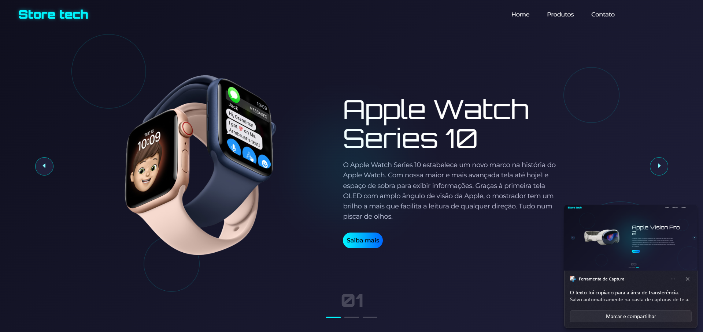
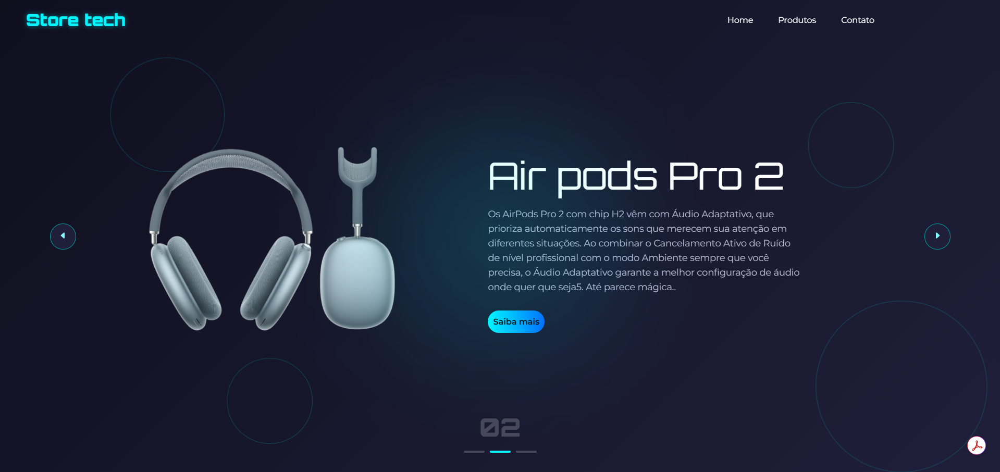
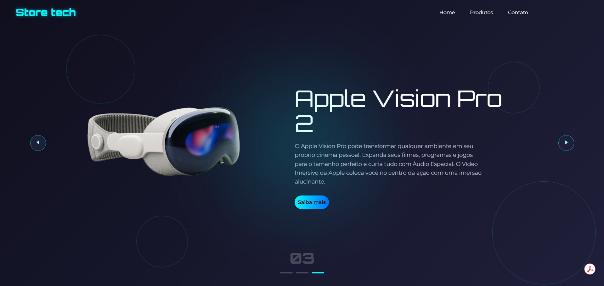

Este projeto é uma landing page de tecnologia, desenvolvida em HTML + CSS + JavaScript como parte das aulas do Dev Club.
O objetivo é treinar construção de interfaces modernas, focando em design UI/UX, responsividade e interatividade, criando uma experiência visual mais profissional e atrativa.

---

 
 

## 🚀 Funcionalidades

Exibição de produto em destaque (Hero Section)  
Navegação simples (Home, Produtos, Contato)  
Botão de ação (Call To Action - "Saiba mais")  
Elementos visuais animados (círculos e efeitos) 
Layout moderno com dark mode + gradiente  
Estrutura preparada para evolução (ex: catálogo de produtos)  

 
 

## 🛠️ Tecnologias Utilizadas

HTML5 → Estrutura semântica
CSS3 → Estilização moderna (flexbox, gradientes, efeitos visuais)
JavaScript → Interatividade da página
Live Server (VS Code) → Execução em tempo real

 
 

## 📖 O que aprendi com este projeto

Criar layouts modernos com foco em UI/UX
Trabalhar com posicionamento e responsividade
Aplicar hierarquia visual (título, descrição, CTA)
Utilizar efeitos visuais para melhorar a experiência
Estruturar projetos front-end de forma organizada

 
 

## ⚠️ Observações Importantes

Projeto desenvolvido para fins educacionais. Inspirado em interfaces modernas de produtos tecnológicos
Foco maior em design e experiência do usuário

 
 

## 📸 Capturas de Tela

 
 

## 🌐 Acesse o Projeto

Você pode visualizar o projeto diretamente pelo navegador:  
👉 [https://kelvimarcos.github.io/Loja-virtual-tech/](https://kelvimarcos.github.io/Loja-virtual-tech/)  
Basta clicar no link ou colar no navegador.

 
 

## 📌 Próximos Passos

Melhorar responsividade para mobile
Adicionar animações mais avançadas (ex: GSAP)
Transformar em projeto React (componentização)
Criar página de produtos dinâmica

 
 

## 🧠 Insight rápido

Projeto simples, mas com visual forte — isso já te posiciona melhor que muito dev iniciante.
Se subir isso com deploy + responsividade bem feita, vira portfólio competitivo.
